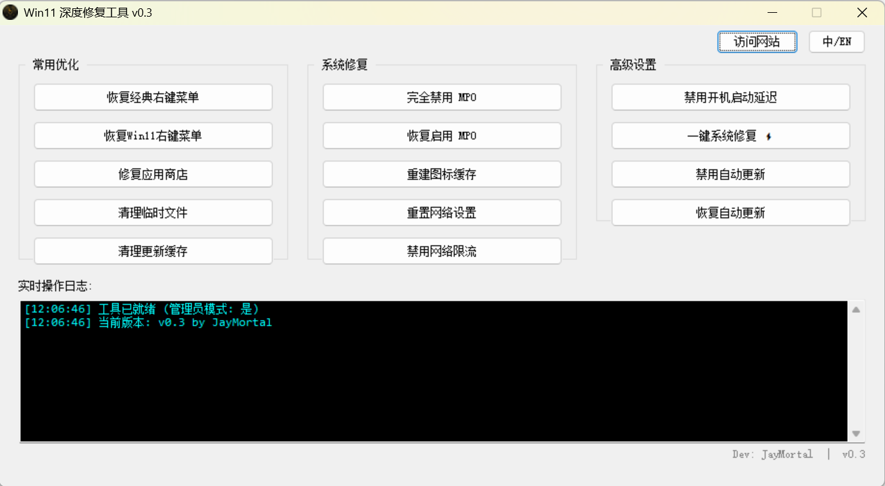
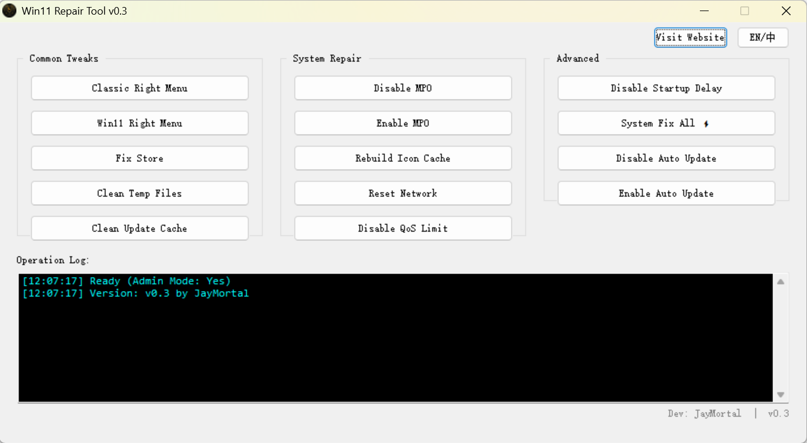

# Win11 深度修复工具 🛠️

  
  
  
  
  
  
  **一款专为 Windows 11 设计的系统优化和修复工具**
  
  简体中文 | [English](README_EN.md)
  

---

## ✨ 项目简介

Win11 深度修复工具是一款轻量级、易用的 Windows 11 系统维护工具，集成了 11 个实用功能，帮助用户快速解决常见的系统问题和优化体验。

**核心特性：**
- 🎯 **一键操作** - 无需复杂命令，点击即可完成操作
- 🌍 **双语支持** - 自动识别系统语言，支持中英文切换
- 📊 **实时日志** - 树状结构显示操作进度，清晰直观
- 🔒 **安全可靠** - 所有操作可逆，支持恢复默认设置
- 🎨 **现代界面** - 三列布局，分类清晰，易于操作

---

## 🚀 功能一览

### 常用优化
- ✅ **恢复经典右键菜单** - 告别 Win11 臃肿的右键菜单
- ✅ **修复应用商店** - 解决商店闪退、下载失败问题
- ✅ **清理临时文件** - 释放磁盘空间（通常可清理数 GB）
- ✅ **清理更新缓存** - 解决 Windows Update 卡住问题

### 系统修复
- 🔧 **显卡 MPO 优化** - 解决游戏卡顿、花屏问题
- 🔧 **重建图标缓存** - 修复图标显示异常
- 🔧 **重置网络设置** - 一键修复网络连接问题
- 🔧 **禁用网络限流** - 解除系统带宽限制

### 高级设置
- ⚙️ **禁用开机启动延迟** - 让自启程序瞬间启动
- ⚙️ **一键系统修复** - 自动运行 DISM + SFC 完整修复
- ⚙️ **管理自动更新** - 禁用/恢复 Windows 自动更新

---

## 📸 界面预览

### 中文界面

### 英文界面

---

## 📥 下载与安装

### 方式一：直接下载（推荐）
👉 [前往 Releases 下载最新版](../../releases)

下载 `Win11RepairTool.exe` 后，右键选择 **"以管理员身份运行"** 即可。

### 方式二：从源码编译
1. 安装 [AutoIt](https://www.autoitscript.com/site/autoit/downloads/)
2. 克隆本仓库：git clone https://github.com/JayMortal/Win11-Repair-Tool.git
3. 右键点击 `.au3` 文件 → **"Compile Script"**

---

## 💡 使用说明

### 系统要求
- **操作系统**: Windows 11（64位）
- **权限**: 需要管理员权限
- **依赖**: 无需安装额外组件

### 操作步骤
1. 以管理员身份运行程序
2. 根据需求选择对应功能按钮
3. 按照提示确认操作
4. 查看日志窗口了解执行结果

### 语言切换
- 程序会自动检测系统语言
- 点击右上角 **"中/EN"** 按钮可手动切换

---

## ⚠️ 重要提示

- ⚡ **"一键系统修复"** 功能需要 10-30 分钟，请耐心等待
- 🔄 部分功能需要 **重启电脑** 才能生效
- 💾 使用高级功能前建议 **备份重要数据**
- ❌ 所有操作均可通过对应的 **"恢复"** 按钮撤销

---

## 🛠️ 技术细节

### 开发环境
- **语言**: AutoIt v3.3.16+
- **编译器**: AutoIt3Wrapper
- **架构**: 单文件可执行程序

### 主要技术
- 注册表安全操作封装
- 多语言动态切换机制
- 树状日志实时显示
- 命令行执行错误处理

---

## 📝 更新日志

### v0.3 (2025-12-09)
- ✨ 新增 11 个核心功能
- 🌍 支持中英文双语界面
- 🎨 采用三列布局设计
- 📊 实时日志树状显示
- 🔗 集成官网访问入口

---

## 🤝 贡献指南

欢迎提交 Issue 和 Pull Request！

### 如何贡献
1. Fork 本仓库
2. 创建特性分支 (`git checkout -b feature/AmazingFeature`)
3. 提交更改 (`git commit -m 'Add some AmazingFeature'`)
4. 推送到分支 (`git push origin feature/AmazingFeature`)
5. 提交 Pull Request

### 反馈问题
如果遇到 Bug 或有功能建议，请 [提交 Issue](../../issues)。

---

## 📄 开源协议

本项目采用 [MIT License](LICENSE) 开源协议。

这意味着你可以自由地：
- ✅ 使用、复制、修改、合并、发布、分发本软件
- ✅ 将本软件用于商业用途
- ⚠️ 需要保留版权声明和许可声明

---

## 👨‍💻 作者信息

**JayMortal**  
🌐 官方网站: [yjggfun.com](https://yjggfun.com)  
💬 联系方式: 通过 [Issues](../../issues) 或访问官网

---

## ⭐ Star History

如果这个项目对你有帮助，请点个 **Star** ⭐ 支持一下！

---

  
  **用心打造 | Made with ❤️ by JayMortal**
  
  [⬆ 回到顶部](#win11-深度修复工具-)
  

